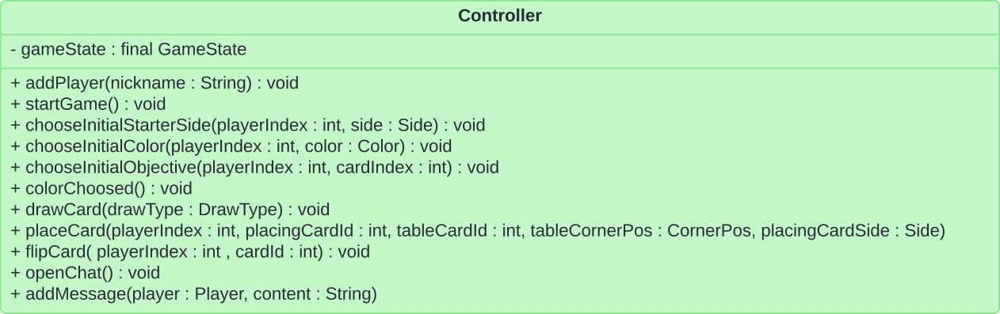
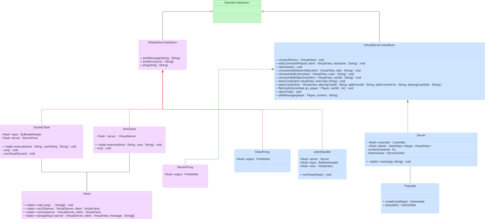

# Model

## Card

This section provides a concise overview of the class structure we implemented to represent the different card types.


The following table summarizes the common attributes shared by all card types, facilitating their organization into classes and subclasses.

| Card      | Has Corner (4) | Has Resource Corner (max 4) | Has Item Corner (max 1) | Has Points | Has Challenge | Has Resource Needed (max 5) | Has Back Resource |
|-----------|----------------|-----------------------------|-------------------------|------------|---------------|-----------------------------|-------------------| 
| Resource  | x              | x                           | x                       | x          |               |                             | x                 | 
| Gold      | x              |                             | x                       | x          | x             | x                           | x                 |
| Starter   | x              | x                           |                         |            |               |                             | x (max 3)         |
| Objective |                |                             |                         | x          | x             |                             |                   |  

Within the "cards" package, all classes and interfaces are declared final except for `CoveredCorner` and `LinkedCorner` in the `Corner` class.

### CornerCard

Conversely, a visible corner with no element present is included in the array and marked with `EMPTY`.

- `covered` : true if there is another card on top, else false
- `element` : represents the content occupying this corner. It can be a `Resource` or an `Item`. If no element is present, the value is set to `Element.EMPTY`
- `cardId` : identifies the card this corner belongs to
- `linkedCorner` : points to another `CornerCard` if the two corners are connected. A `null` value signifies the corner isn't linked to any other card.
- `getUncoveredCorners` : returns a list of all currently uncovered corners
- `getUncoveredElement` : returns all the elements (`Resource` and `Item`) of all currently uncovered corners


#### GoldCard

If the `challenge` attribute is `null` the points are gained automatically.
The `ResourceType` is the type of resource and it is also used to identify the color.

#### ResourceCard

We will later add methods that will return the number of a specific resource/item on the corners of the card, they will all use `getUncoveredElement`.

#### StarterCard

In the front there are always 4 corners with all the elements, in the back the corners can be hidden or empty and there are `backResources`.

### ObjectiveCard

Note that the `Challenge` is the one you do in order to gain points and `Objective` is the type of card.

### Challenge

This is the one you must do in order to gain points. It is used in `ObjectiveCard` and `GoldCard`. More details later.

#### Structure Challenge
The structure challenge is only for objective cards.


#### Resource Challenge
The resource challenge is only for objective cards. The type of resources needed in the objective cards can vary.

In the objective cards is like this:


#### Item Challenge
The item challenge is only for gold cards.

In the gold cards is like this (the one on the top of the card):


#### Coverage Challenge
This challenge is only for gold cards.
Is the one on the top of the card.


Here is the UML for both the Card and the Challenge:

`StructureChallenge` and `ElementChallenge` are used in `Objective`.  
`GoldCoverageChallenge` and `ElementChallenge` are used in `GoldCard`.

Note that challenge can be null. `challenge` in the `GoldCard` is the challenge to do in order to do point.
Also note that for the `GoldCoverageChallenge` the value of `points` is always 2.

The `configuration` is a 3x3 matrix of elements (resources actually), the element refers to the color of the card and the position is determined by the position in the matrix

About element:

- In `goldCards`, `Element.size() == 1`
- In `obectiveCards`:
    - example of 3 animal: `element=[animal, animal, animal]`
    - example of 1 Quill and  2 Inkwell: `element = [Quill, Inkwell, Inkwell]`

Order from top-left to bottom-left \[0-3\]

```
01  
32
```

#### GoldCard

If the `challenge` attribute is `null`, points are awarded automatically when the card is played.
The `ResourceType` defines the type of resource (also serves as the color identifier).

#### ResourceCard

The Resource Card are the only type of card that requires resources to be places.

#### StarterCard

The card's front side consistently features four corners, each containing an `Element`.
Conversely, the back side's corners can be hidden (represented by `null`) or empty (marked with `EMPTY`).
Additionally, the back side may include `backResources`, to represent resources specific to the back center.

### ObjectiveCard

A `Challenge` is a specific task a player must complete to earn points.
Conversely, `Objective` refers to the overall category or type the card belongs to.

### Challenge

The `Challenge` attribute represents a specific task a player must complete to acquire points.
It's employed within both `ObjectiveCard` and `GoldCard` classes.
Further details regarding Challenge functionality will be provided later.

#### Structure Challenge

The structure challenge is used only for objective cards.

The `configuration` attribute is a 3x3 matrix of `Elements` (specifically Resources).
The `Element` refers to the `resourceType` of the card and the position is determined by the position in the matrix.

Order from top-left to bottom-left \[0-3\]


#### Element Challenge

`Objective` cards leverage the `Challenge` attribute to define tasks players must complete to earn points.
These tasks exhibit variability in the types of resources required.

Here's a breakdown of how resources are typically handled within objective cards:


#### Coverage Challenge

This challenge is used exclusively for gold cards.
The challenge defines a point-awarding task based on the quantity of specified `Elements` present on the player's board.


Note that for the `GoldCoverageChallenge` the value of `points` is always 2.

## GameState

The `GameState` is the most important class. It is where all the information regarding the game are stored. In this section we will discuss some of its main features.

The first player (index = 0) in the data structure is the Black player, `public Player getBlackPlayer() { return player[0] }`.
Note that a **round** is made up by 4 **turns**.

The players order in game is defined by the order of the players in the `players[]` array.


In the methods of the `Board` class, `pos` specify the position of the card (1 if it's the first, 2 if it's the second one)

## Enumerations

This section details the enumerated data types we'll employ to represent various game concepts.
Due to graphical complexity, we won't illustrate all associations with other classes.
However, it's important to remember that these enumerations are indeed connected to the classes that utilize them for data definition.


# Controller

- `drawCard` : this method retrieves a card from the appropriate deck based on the requesting card's class. For instance, if the requesting card belongs to the `ResourceCard` class, the method would draw from the resource deck.
- `placeCard` : while a single card placement is required through this method, you can still gain information about any affected multi-corner cards by examining the method's return value. The `cornerTableIndex` parameter specifies the corner on the table where the player intends to connect the card.
- `getGameState` : this method provides a comprehensive overview of the current game state.
- `flipCard` : this method flips the card currently held by the player. Subsequently, the placeCard method will utilize the flipped side for placement.



# Exceptions

While testing the constructors and some methods we noticed that defining some exceptions would have helped us a lot in managing problems. Here are some of the examples:

- `CardAlreadPlacedException`
- `CardAlreadyPresentOnTheCornerException`
- `CardIsNotInHandException`
- `CardNotPlacedException`
- `GameIsNotEndedException`
- `GoldCardCannotBePlacedException`
- `InvalidHandException`  (more than 3 cards in the hand)
- `InvalidObjectiveCardException`
- `NotUniquePlayerColorException` (two players have the same color)
- `NotUniquePlayerNicknameException` (two players have the same nickname)
- `PlacingOnHiddenCornerException`
- `WrongInstanceTypeException`
- `WrongPlacingPositionException`
- `WrongStructureConfigurationSizeException` (structure is the one in challenge)


# Network

## Introduzione

### Diagramma UML Classi Network

Iniziamo a mostrare le classi che abbiamo introdotto per gestire la comunicazione tra server e client.



### Flusso di Comunicazione


### Integrazione tra RMI e Socket

Per poter facilitare lo sviluppo della parte `Server`, la chiamata di metodi al `Controller` vengono *unificate*, sia che siano provenienti dal socket, sia che siano provenienti da RMI.
Questo comportamento viene raggiunto chiamando direttamente i metodi del `Server` dall'`RMIClient` nel caso di RMI e dal `ClientHandler` nel caso di socket, che una volta ricevuto un nuovo comando nel suo buffer di ricezione, se nota che è un comando disponibile, chiamerà lo stesso identico metodo chiamato da RMI.
Per questo motivo sia RMI che Socket utilizzano metodi che hanno come argomenti stringhe, che vengono convertite nelle strutture dati apposite nei metodi del `Server`, in modo da chiamare i metodi corrispondenti del `Controller`, i metodi presenti nell'interfaccia `VirtualServer` sono infatti gli stessi metodi del `Controller` con gli argomenti di tipo Stringa al posto delle strutture dati usate nel `Model`

### Formattazione dei messaggi

#### Client to Server

I messaggi *Client to Server* sono del tipo: `"COMANDO, parametro1, ..., parametro"`.

- `COMANDO`: Indica il tipo di metodo che il client desidera chiamare
- I parametri del metodo sono codificati in formato di stringhe

Lista di comandi possibili: `ADDUSER`, `START`, `CHOOSESTARTER`, `CHOOSECOLOR`, `CHOOSEOBJECTIVE`, `PLACECARD`, `DRAWCARD`, `FILPCARD`, `OPENCHAT`, `ADDMESSAGE`.


#### Server to Client

Analogamente, nella comunicazione *Server to Client* i messaggi sono formattati come: `"COMANDO, MESSAGGIO"`.

- `COMANDO`: Specifica se la comunicazione è riferita ad un messaggio generico, di errore o di ping
- il messaggio è codificato in forma di stringa

Lista di comandi possibili: `MESSAGE` , `ERROR` , `PING`.

- `MESSAGE` : serve ad inviare alla view un feedback positivo (aggiornamento del model)
- `ERROR` : serve ad inviare alla view un errore
- `PING` : serve a verificare la connessione del client prima di inviargli un messaggio, ad un client viene inviato un ping prima di ogni messaggio effettivo, e vengono inviati dei ping periodici a tutti i client in modo che il `Model` sia a conoscenza dei giocatori connessi, per poter attribuire le fasi del gioco in modo corretto

## Server

- All'avvio, il Server istanzia un `Controller` del gioco e gestice la rete RMI e Socket, istanziando un `java.net.ServerSocket` per Socket e un RemoteObject per RMI sulla porte specificate dalla riga di comando, è presente infatti un singolo server che gestisce le chiamate da Socket e RMI. L'istanziazione del Controller avviene pasandogli il `GameState`, istanziato con l'utilizzo di populate, dove viene usato il JSON per istanziare le carte e tutto quello che serve al `GameState`
- Il `Server` si pone in attesa di una richiesta di associazione da parte di un client che ha intenzione comunicare con il server sulla porta appena aperta
- Il `Server` salva i `Client` che si connettono, in ordine di arrivo, all'interno di una lista (condivisa sia per i client RMI che per quelli Socket). L'ordine dei `Client` di questa lista corrisponde all'ordine dei `Player` nella lista dei giocatori del model.
  Se un giocatore si disconnette prima di aver scelto il nickname, non viene incluso nella lista dei clients. Contrariamente se un giocatore si disconnette dopo aver scelto il nickname, rimane nella lista dei clients sia nel server che nel model. Le informazioni sulla sua connessione vengono conservate e aggiornate nel model. Il giocatore ha la possibilità di riconnettersi successivamente tramite il suo nickname.
- RMI
    - I metodi del `Server` sono messi a disposizione diretta da parte del client
- Socket
    - Se l'associazione ha successo, viene istanziato un `ClientHandler` che richiede il server corrente e due stream, uno di ricezione e uno di trasmissione (di conseguenza esiste un `ClientHandler` per ogni client)
        - il `ClientHandler`, quando viene istanziato, a sua volta istanzia il `ClientProxy`, che richiede lo stream di output per essere istanziato
        - lo stream di output del `ClientProxy` è utilizzato dal server per scrivere i dati, che attraverso il protocollo TCP/IP raggiungono il buffer di ricezione del `SocketClient`
    - Dopo l'istanziazione del `ClientHandler`, viene creato un Thread il cui compito è eseguire `ClientHandler.runVirtualView`, che legge dal suo stream di ricezione per individuare nuovi comandi da processare
    - Una volta ricevuti dei dati sul buffer, il `ClientHandler` controlla la corretta formattazione dei parametri e chiama il metodo del server corrispondente al comando ricevuto, questo  per semplificare l'integrazione con RMI, che utilizza lo stesso server.
    - Dopo aver ricevuto un comando, il Server chiama il metodo relativo al comando nel Controller
    - Nel caso di feedback da comunicare al client, il metodo `ClientHandler.printMessage(String)` viene chiamato. Questo metodo, a sua volta, chiama `ClientProxy.printMessage(String)`, il quale formatta il messaggio secondo il nostro protocollo proprietario e lo scrive sul suo stream di output. Successivamente, il messaggio viene inviato al client attraverso il protocollo TCP/IP. La stessa cosa avviene nel caso di errori da comunicare al client, con le chiamate di `ClientHandler.printError(String)` e `ClientProxy.printError(String)`


## Client

È presente un Client che, a seconda che l'utente voglia utilizzare Socket o RMI, chiama il metodo Execute della classe corrispondente

### Socket Client

- Il `SocketClient` quando viene eseguito crea due buffer derivati da due stream: uno per la ricezione e uno per la trasmissione dei dati. Inoltre, istanzia un `ServerProxy`
    - Il `ServerProxy` richiede lo stream di trasmissione per scrivere le informazioni da inviare al server (al `ClientHandler` del server)
- Viene istanziato un `Thread` che esegue `SocketClient.runVirtualServer()`, responsabile dell'ascolto dei messaggi provenienti dal server
- Simultaneamente, il `SocketClient` avvia una delle due interfacce utente (CLI/TUI o GUI)
- la view riceve i comandi per giocare/creare un utente/... dall'utente
- Una volta riconosciuto un comando correttamente formattato (la formattazione sarà descritta in seguito), Il comando, insieme ai relativi parametri, viene scritto secondo una sintassi proprietaria sul buffer di uscita del `ServerProxy`
- Dopo la scrittura del comando, questo viene trasferito tramite il protocollo TCP/IP al buffer di ingresso del `ClientHandler` e sarà "catturato/letto" da `ClientHandler.runVirtualView`

### RMI Client

Il client RMI come da definizione, cerca sull'indirizzo del server il registry corrispondente e una volta instaurata la connessione chiama la *view* corrispondente per interpretare i comandi dell'utente e chiamare i metodi del server corrispondenti.


# Complete UML

(you can *zoom* it)


