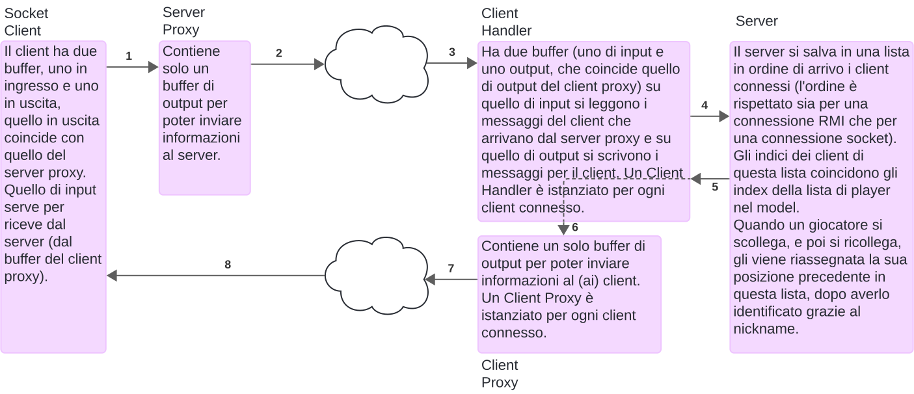

# Introduzione 

## Diagramma UML Classi Network 

Iniziamo a mostrare le classi che abbiamo introdotto per gestire la comunicazione tra server e client.

## Architettura di Rete Socket

La architettura RMI è di facile comprensione, pensiamo che sia di maggiore rilevanza dare spazio all'architettura socket che abbiamo implementato.

## Flusso di Comunicazione

## Integrazione tra RMI e Socket

Per poter facilitare lo sviluppo della parte `Server`, la chiamata di metodi al `Controller` vengono *unificate*, sia che siano provenienti dal socket, sia che siano provenienti da RMI.
Questo comportamento viene raggiunto chiamando direttamente i metodi del `Server` dall'`RMIClient` nel caso di RMI e dal `ClientHandler` nel caso di socket, che una volta ricevuto un nuovo comando nel suo buffer di ricezione, se nota che è un comando disponibile, chiamerà lo stesso identico metodo chiamato da RMI.

## Formattazione dei messaggi

### Client to Server

I messaggi *Client to Server* sono del tipo: `"COMANDO, parametro1, ..., parametro"`.

- `COMANDO`: Indica il tipo di metodo che il client desidera chiamare
- I parametri del metodo sono codificati in formato di stringhe

Lista di comandi possibili: `ADDUSER`, `START`, `CHOOSESTARTER`, `CHOOSECOLOR`, `CHOOSEOBJECTIVE`, `PLACECARD`, `DRAWCARD`, `FILPCARD`, `OPENCHAT`, `ADDMESSAGE`.

### Server to Client

Analogamente, nella comunicazione *Server to Client* i messaggi sono formattati come: `"COMANDO, MESSAGGIO"`.

- `COMANDO`: Specifica se la comunicazione è riferita ad un messaggio generico, di errore o di ping 
- il messaggio è codificato in forma di stringa

Lista di comandi possibili: `MESSAGE` , `ERROR` , `PING`.

# Server

- All'avvio, il Server istanzia un `Controller` del gioco e gestice la rete RMI e Socket, istanziando un `java.net.ServerSocket` per Socket e un RemoteObject per RMI sulla porte specificate dalla riga di comando, è presente infatti un singolo server che gestisce le chiamate da Socket e RMI.
- Il `Server` si pone in attesa di una richiesta di associazione da parte di un client che ha intenzione comunicare con il server sulla porta appena aperta
- RMI
  - I metodi del `Server` sono messi a disposizione diretta da parte del client
- Socket 
  - Se l'associazione ha successo, viene istanziato un `ClientHandler` che richiede il server corrente e due stream, uno di ricezione e uno di trasmissione (di conseguenza esiste un `ClientHandler` per ogni client)
    - il `ClientHandler`, quando viene istanziato, a sua volta istanzia il `ClientProxy`, che richiede lo stream di output per essere istanziato
    - lo stream di output del `ClientProxy` è utilizzato dal server per scrivere i dati, che attraverso il protocollo TCP/IP raggiungono il buffer di ricezione del `SocketClient`
  - Dopo l'istanziazione del `ClientHandler`, viene creato un Thread il cui compito è eseguire `ClientHandler.runVirtualView`, che legge dal suo stream di ricezione per individuare nuovi comandi da processare
  - Una volta ricevuti dei dati sul buffer, il `ClientHandler` controlla la corretta formattazione dei parametri e chiama il metodo del server corrispondente al comando ricevuto, questo  per semplificare l'integrazione con RMI, che utilizza lo stesso server. 
  - Dopo aver ricevuto un comando, il Server chiama il metodo relativo al comando nel Controller
  - Nel caso di feedback da comunicare al client, il metodo `ClientHandler.printMessage(String)` viene chiamato. Questo metodo, a sua volta, chiama `ClientProxy.printMessage(String)`, il quale formatta il messaggio secondo il nostro protocollo proprietario e lo scrive sul suo stream di output. Successivamente, il messaggio viene inviato al client attraverso il protocollo TCP/IP. La stessa cosa avviene nel caso di errori da comunicare al client, con le chiamate di `ClientHandler.printError(String)` e `ClientProxy.printError(String)`

- TODO: Siega Ping da qualche parte

# Client

## Socket Client

- Il `SocketClient` quando viene eseguito crea due buffer derivati da due stream: uno per la ricezione e uno per la trasmissione dei dati. Inoltre, istanzia un `ServerProxy`
  - Il `ServerProxy` richiede lo stream di trasmissione per scrivere le informazioni da inviare al server (al `ClientHandler` del server)
- Viene istanziato un `Thread` che esegue `SocketClient.runVirtualServer()`, responsabile dell'ascolto dei messaggi provenienti dal server
- Simultaneamente, il `SocketClient` avvia una delle due interfacce utente (CLI/TUI o GUI)
- la view riceve i comandi per giocare/creare un utente/... dall'utente
- Una volta riconosciuto un comando correttamente formattato (la formattazione sarà descritta in seguito), Il comando, insieme ai relativi parametri, viene scritto secondo una sintassi proprietaria sul buffer di uscita del `ServerProxy`
- Dopo la scrittura del comando, questo viene trasferito tramite il protocollo TCP/IP al buffer di ingresso del `ClientHandler` e sarà "catturato/letto" da `ClientHandler.runVirtualView`

## RMI Client

Il client RMI come da definizione, cerca sull'indirizzo del server il registry corrispondente e una volta instaurata la connessione chiama la *view* corrispondente per interpretare i comandi dell'utente e chiamare i metodi del server corrispondenti. 

# Appendice

## Diagramma UML Classi Model

## Diagramma UML Classi Controller

## Diagramma UML Classi Completo

