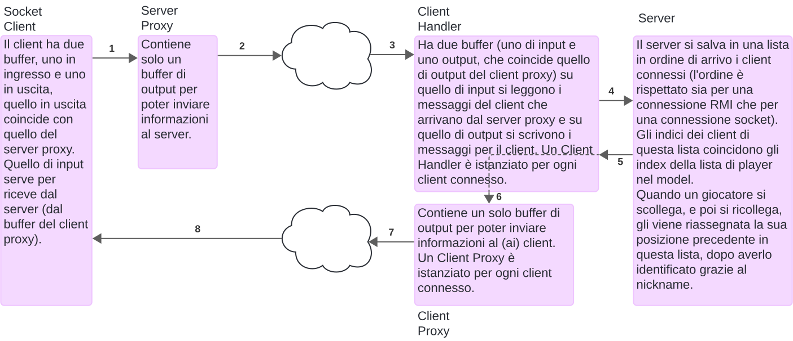

# Diagramma Classi Network 

> TODO: metti svg classi

# RMI

> TODO: velocemente dire che abbiamo usato RMI bene 

# Socket

## Architettura di rete socket

## Flusso di comunicazione

> TODO: metti svg flusso

**POV Server**:

- all'avvio, il Server istanzia un `Controller` del gioco e un `java.net.ServerSocket` sulla porta specificata dalla riga di comando.
- il `Server` si pone in attesa di una richiesta di associazione da parte di un client che ha intenzione comunicare con il server sulla porta appena aperta
- se l'associazione ha successo, viene istanziato un `ClientHandler` che richiede il server corrente e due stream, uno di ricezione e uno di trasmissione (di conseguenza esiste un `ClientHandler` per ogni client)
  - il `ClientHandler`, quando viene istanziato, a sua volta istanzia il `ClientProxy`, che richiede lo stream di output per essere istanziato
  - lo stream di output del `ClientProxy` è utilizzato dal server per scrivere i dati, che attraverso il protocollo TCP/IP raggiungono il buffer di ricezione del `SocketClient`
- dopo l'istanziazione del `ClientHandler`, viene creato un Thread il cui compito è eseguire `ClientHandler.runVirtualView`, che legge dal suo stream di ricezione per individuare nuovi comandi da processare
- se ci sono nuovi comandi da processare, viene controllata la corretta formattazione dei parametri e viene eseguita la chiamata al server associato al ClientHandler del metodo corrispondente al comando ricevuto
  - il comando passa attraverso il ClientHandler e poi al Server per semplificare l'integrazione con RMI. Ulteriori dettagli saranno forniti successivamente
- dopo aver ricevuto un comando, il Server chiama il metodo relativo al comando nel Controller
- Nel caso di errori o feedback da comunicare al client, il metodo `ClientHandler.printMessage(String)` viene chiamato. Questo metodo, a sua volta, chiama `ClientProxy.printMessage(String)`, il quale formatta il messaggio secondo il nostro protocollo proprietario e lo scrive sul suo stream di output. Successivamente, il messaggio viene inviato al client attraverso il protocollo TCP/IP.

**POV Client**:

- il `SocketClient` quando viene eseguito crea due buffer derivati da due stream: uno per la ricezione e uno per la trasmissione dei dati. Inoltre, istanzia un `ServerProxy`
  - Il `ServerProxy` richiede lo stream di trasmissione per scrivere le informazioni da inviare al server (al `ClientHandler` del server)
- Viene istanziato un `Thread` che esegue `SocketClient.runVirtualServer()`, responsabile dell'ascolto dei messaggi provenienti dal server
- Simultaneamente, il `SocketClient` avvia una delle due interfacce utente (CLI/TUI o GUI)
- la view riceve i comandi per giocare/creare un utente/... dall'utente
- una volta riconosciuto un comando correttamente formattato (la formattazione sarà descritta in seguito), Il comando, insieme ai relativi parametri, viene scritto secondo una sintassi proprietaria sul buffer di uscita del `ServerProxy`
- dopo la scrittura del comando, questo viene trasferito tramite il protocollo TCP/IP al buffer di ingresso del `ClientHandler` e sarà "catturato/letto" da `ClientHandler.runVirtualView`

# Integrazione tra RMI e Socket

> TODO: dobbiamo spiegare come facciamo a comunicare con lo stesso server
