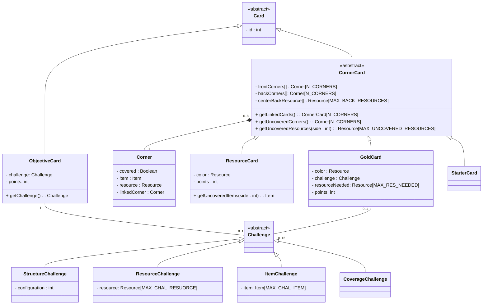
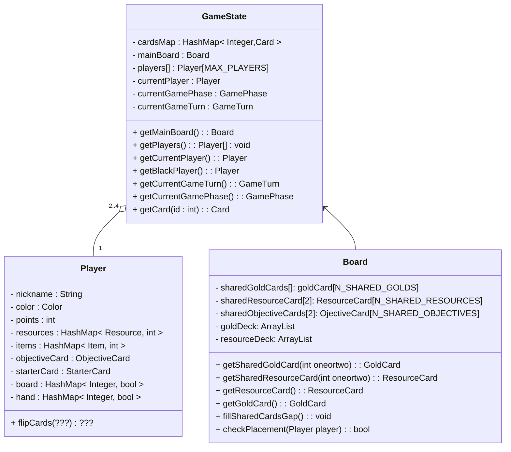
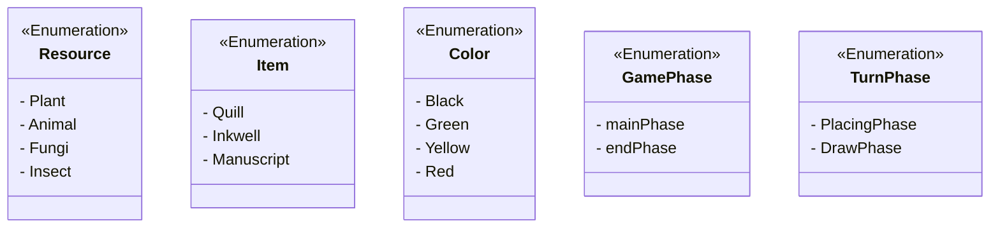
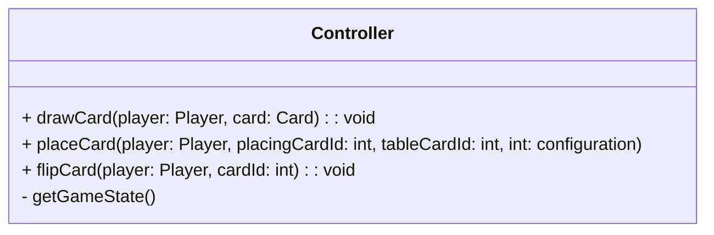

# Model 

## Card
In this section we will shortly explain how we structured the classes regarding the various types of cards.

Here is a table that shows what all the types of cards have in common, so that it is easier to aggregate them into classes and subclasses.

| Card      | Has Corner (4) | Has Resource Corner (max 4) | Has Item Corner (max 1) | Has Points | Has Challenge | Has Resource Needed (max 5) | Has Back Resource |
|-----------|----------------|-----------------------------|-------------------------|------------|---------------|-----------------------------|-------------------| 
| Resource  | x              | x                           | x                       | x          |               |                             | x                 | 
| Gold      | x              |                             | x                       | x          | x             | x                           | x                 |
| Starter   | x              | x                           |                         |            |               |                             | x (max 3)         |
| Objective |                |                             |                         | x          | x             |                             |                   |  

The Cards are never discarded, they are always used for something.

### Challenge

#### Structure Challenge
The structure challenge is only for objective cards.


#### Resource Challenge
The resource challenge is only for objective cards. The type of resources needed in the objective cards can vary.

In the objective cards is like this:


#### Item Challenge
The item challenge is only for gold cards.

In the gold cards is like this (the one on the top of the card):

 

#### Coverage Challenge
This challenge is only for gold cards.
Is the one on the top of the card.

   

Here is the UML for both the Card and the Challenge:



`StructureChallenge` and `ElementChallenge` are used in `Objective`.  
`GoldCoverageChallenge` and `ElementChallenge` are used in `GoldCard`.

Note that challenge can be null. `challenge` in the `GoldCard` is the challenge to do in order to do point. 
Also note that for the `GoldCoverageChallenge` the value of `points` is always 2.

The `configuration` can have any type since the number of configuration is limited, `int` is probably the most practical.

About element:

- In `goldCards`, `Element.size() == 1`  
- In `obectiveCards`: 
    - example of 3 animal: `element=[animal, animal, animal]`
    - example of 1 Quill and  2 Inkwell: `element = [Quill, Inkwell, Inkwell]` 

Probably we should give an id to all the cards so that we can render them with the right texture, and we can track which one has been used or not.

`covered` is true only if is under another corner.

Order from top-left to bottom-left \[0-3\]

```
01  
32
```

The arrays have a null value if the corner do not exist.

## GameState 

The first player in the data structure is the black one, something like `public Player blackPlayer() { return player[0] }`. 
Note that a **round** is made up by 4 **turns**.




## Enumerations

We will use some enumerations to define our data types. 
We cannot show all the association with the other classes because graphically it would be confused. Just remind that these object are actually associated with the classes that make use of them.



# Controller

We started implementing the Controller while we are still studying how to implement the View, so it is still *wip*.

- `drawCard` takes a card from the deck of cards, you can understand from which deck to draw based on the class of the `card` 
- In `placeCard` you can retrieve the information of a multiple corner placed card by checking in the method, you just need to place it on one single card, even if it will affect another card.
- `getGameState` is the method to get all the method game state information, we can later decide to subdivide it into multiple methods
- `fliCard` is used to flip the card the player has in hand, then in `placeCard` it will be placed using the side that this method defines. It is implemented changing the value in the hash map



# View

*wip*

# Complete UML 

```mermaid
classDiagram
  class GameState {
    - cardsMap: HashMap< Integer, Card >
    - mainBoard: Board
    - players[]: Player[MAX_PLAYERS]
    - currentPlayer: Player
    - currentGamePhase: GamePhase
    - currentGameTurn: GameTurn
    + getMainBoard(): Board
    + getPlayers(): Player[]: void
    + getCurrentPlayer(): Player
    + getBlackPlayer(): Player
    + getCurrentGameTurn(): GameTurn
    + getCurrentGamePhase(): GamePhase
    + getCard(id: int): Card
  }

  class Player {
    - nickname: String
    - color: Color
    - points: int
    - resources: HashMap< Resource, int >
    - items: HashMap< Item, int >
    - objectiveCard: ObjectiveCard
    - starterCard: StarterCard
    - board: HashMap< Integer, bool >
    - hand: HashMap< Integer, bool >
    + flipCards(???) ???
  }
  GameState "2..4" o-- "1" Player
  
  class Board {
    - sharedGoldCards[]: goldCard[N_SHARED_GOLDS]
    - sharedResourceCard[2]: ResourceCard[N_SHARED_RESOURCES]
    - sharedObjectiveCards[2]: OjectiveCard[N_SHARED_OBJECTIVES]
    - goldDeck: ArrayList<GoldCard>
    - resourceDeck: ArrayList<ResourceCard>
    + getSharedGoldCard(int oneortwo): GoldCard
    + getSharedResourceCard(int oneortwo): ResourceCard
    + getResourceCard(): ResourceCard
    + getGoldCard(): GoldCard
    + fillSharedCardsGap(): void
    + checkPlacement(Player player): bool
  }
  GameState <-- Board
  
  
  class Controller {
    + drawCard(player: Player, card: Card): void
    + placeCard(player: Player, placingCardId: int, tableCardId: int, int: configuration)
    + flipCard(player: Player, cardId: int): void
    
    - getGameState()
  }
  
  class Config {
    + MAX_PLAYERS: static final int = 4
    + N_SHARED_GOLDS: static final int = 2
    + N_SHARED_RESOURCES: static final int = 2
    + N_SHARED_OBJECTIVES : static final int = 2
    + N_CORNERS: static final int = 4
    + MAX_BACK_RESOURCES: static final int = 3
    + MAX_RES_NEEDED: static final int = 5
    + MAX_UNCOVERED_RESOURCES: static final int = 4
    + MAX_CHAL_RESOURCE: static final int = 3
    + MAX_CHAL_ITEM: static final int = 3
   }
  
  class Resource {
    <<Enumeration>>
    - Plant
    - Animal
    - Fungi
    - Insect
  }
  
  class Item {
    <<Enumeration>>
    - Quill
    - Inkwell
    - Manuscript
  }
  
  class Color {
    <<Enumeration>>
    - Black
    - Green
    - Yellow
    - Red
  }
  
  class GamePhase {
    <<Enumeration>>
    - mainPhase
    - endPhase
   }
  
  class TurnPhase {
    <<Enumeration>>
    - PlacingPhase
    - DrawPhase
   }
  
  class Card {
    <<abstract>>
    - id: int
  }
  
  class ObjectiveCard {
  - challenge: Challenge
  - points: int
  + getChallenge(): Challenge
  }
  Card <|-- ObjectiveCard
  
  class CornerCard {
    <<asbstract>>
    - frontCorners[]: Corner[N_CORNERS]
    - backCorners[]: Corner[N_CORNERS]
    - centerBackResource[]: Resource[MAX_BACK_RESOURCES]
    + getLinkedCards(): CornerCard[N_CORNERS]
    + getUncoveredCorners(): Corner[N_CORNERS]
    + getUncoveredResources(side: int): Resource[MAX_UNCOVERED_RESOURCES]
  }
  Card <|-- CornerCard
  
  class Corner {
    - covered: Boolean
    - item: Item
    - resource: Resource
    - linkedCorner: Corner
   }
  CornerCard "6..8" *-- "1" Corner
  
  class ResourceCard {
    - color: Resource
    - points: int
    + getUncoveredItems(side: int): Item
   }
  CornerCard <|-- ResourceCard
  
  class GoldCard {
    - color: Resource
    - challenge: Challenge
    - resourceNeeded: Resource[MAX_RES_NEEDED]
    - points: int
  }
  CornerCard <|-- GoldCard
  
  class StarterCard { 
  
   }
  CornerCard <|-- StarterCard
  
  class Challenge {
    <<abstract>>
  }
  ObjectiveCard "1" -- "0..1" Challenge
  GoldCard "0..1" -- "0..12" Challenge
  
  class StructureChallenge {
    - configuration: int
  }
  Challenge <|-- StructureChallenge
  
  class ResourceChallenge {
    - resource: Resource[MAX_CHAL_RESUORCE]
  }
  Challenge <|-- ResourceChallenge
  
  class ItemChallenge {
    - item: Item[MAX_CHAL_ITEM]
  }
  Challenge <|-- ItemChallenge
  
  class CoverageChallenge { 
  
   }
  Challenge <|-- CoverageChallenge
```


