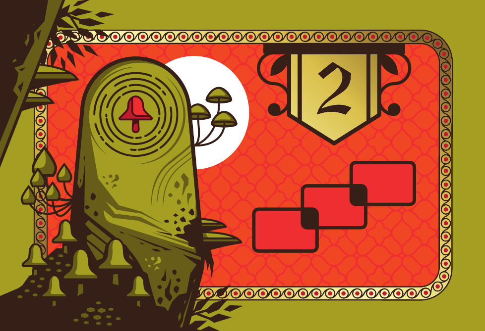

# Model 

## Card

In this section we will shortly explain how we structured the classes regarding the various types of cards.


Here is a table that shows what all the types of cards have in common, so that it is easier to aggregate them into classes and subclasses.

| Card      | Has Corner (4) | Has Resource Corner (max 4) | Has Item Corner (max 1) | Has Points | Has Challenge | Has Resource Needed (max 5) | Has Back Resource |
|-----------|----------------|-----------------------------|-------------------------|------------|---------------|-----------------------------|-------------------| 
| Resource  | x              | x                           | x                       | x          |               |                             | x                 | 
| Gold      | x              |                             | x                       | x          | x             | x                           | x                 |
| Starter   | x              | x                           |                         |            |               |                             | x (max 3)         |
| Objective |                |                             |                         | x          | x             |                             |                   |  

In the cards package (cards, corner, challenges) everything is final except covered and linkedCorner in Corner

### CornerCard

Note that corner is `null` in the array if the corner is hidden.
The corner that is visible but with no element, is not null in the array and has `EMPTY` in element

- `covered` true if there is another card on top
- `element` is the element, can be the Resource or the Items in the corner. If it is empty the value is `Element.EMPTY`
- `cardId` is the id of the card (card is the son of `CornerCard`)
- `linkedCorner` if there is a card connected to it, it is a reference to that card, `null` if the corner is not connected to any card
- `getUncoveredCorners` returns all the free corners (back and front)
- `getUncoveredElement` returns all the elements (`Resource` and `Item`)

#### GoldCard

If the `challenge` attribute is `null` the points are gained automatically.
The `ResourceType` is the type of resource and it is also used to identify the color.

#### ResourceCard

We will later add methods that will return the number of a specific resource/item on the corners of the card, they will all use `getUncoveredElement`. 

#### StarterCard

In the front there are always 4 corners with all the elements, in the back the corners can be hidden or empty and there are `backResources`.

### ObjectiveCard

Note that the `Challenge` is the one you do in order to gain points and `Objective` is the type of card.

### Challenge

This is the one you must do in order to gain points. It is used in `ObjectiveCard` and `GoldCard`. More details later.

#### Structure Challenge
The structure challenge is only for objective cards.



#### Resource Challenge
The resource challenge is only for objective cards. The type of resources needed in the objective cards can vary.

In the objective cards is like this:


#### Item Challenge
The item challenge is only for gold cards.

In the gold cards is like this (the one on the top of the card):


#### Coverage Challenge
This challenge is only for gold cards.
Is the one on the top of the card.

 

Here is the UML for both the Card and the Challenge:

`StructureChallenge` and `ElementChallenge` are used in `Objective`.  
`GoldCoverageChallenge` and `ElementChallenge` are used in `GoldCard`.

Note that challenge can be null. `challenge` in the `GoldCard` is the challenge to do in order to do point. 
Also note that for the `GoldCoverageChallenge` the value of `points` is always 2.

The `configuration` is a 3x3 matrix of elements (resources actually), the element refers to the color of the card and the position is determined by the position in the matrix

About element:

- In `goldCards`, `Element.size() == 1`  
- In `obectiveCards`: 
    - example of 3 animal: `element=[animal, animal, animal]`
    - example of 1 Quill and  2 Inkwell: `element = [Quill, Inkwell, Inkwell]` 

Order from top-left to bottom-left \[0-3\]

```
01  
32
```

The arrays have a null value if the corner do not exist.

## GameState 

The first player in the data structure is the black one, `public Player getBlackPlayer() { return player[0] }`. 
Note that a **round** is made up by 4 **turns**.

The players order in game is defined by the order of the players in the array `players[]`.


In the methods of Board class, `pos` means the position of the card (commonly 1 if it's the first, 2 if it's the second one)

## Enumerations

We will use some enumerations to define our data types. 
We cannot show all the association with the other classes because graphically it would be confused. Just remind that these object are actually associated with the classes that make use of them.


# Controller

We started implementing the Controller while we are still studying how to implement the View, so it is still *wip*.

- `drawCard` takes a card from the deck of cards, you can understand from which deck to draw based on the class of the `card` 
- In `placeCard` you can retrieve the information of a multiple corner placed card by checking in the method, you just need to place it on one single card, even if it will affect another card. The parameter `cornerTableIndex` is the corner of the card on the table to which the player is connecting the card.
- `getGameState` is the method to get all the method game state information, we can later decide to subdivide it into multiple methods
- `fliCard` is used to flip the card the player has in hand, then in `placeCard` it will be placed using the side that this method defines. It is implemented changing the value in the hash map


# Exceptions

- `InvalidHandException` (more than 3 cards in the hand)
- `NotUniquePlayerColorException`
- `NotUniquePlayerException`
- `NotUniquePlayerNicknameException`
- `WrongStructureConfigurationSizeException` (structure is the one in challenge)

# View

*wip*

# Complete UML

(you can *zoom* it)


