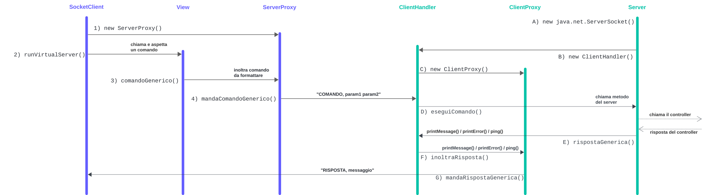

## Integrazione tra RMI e Socket

Per poter facilitare lo sviluppo della parte `Server`, le chiamate di metodi al `Controller` vengono *unificate*, sia che siano provenienti dal socket, sia che siano provenienti da RMI.  
Questo comportamento viene realizzato chiamando direttamente i metodi del `Server` dall'`RMIClient` nel caso di RMI e dal `ClientHandler` nel caso di socket, che, una volta ricevuto un nuovo comando nel suo buffer di ricezione, se nota che è un comando disponibile, chiamerà lo stesso identico metodo chiamato da RMI.
I metodi di virtualView e virtualServer contengono i parametri con i tipi di dato corretti, nel caso di RMI vengono chiamati direttamente i metodi, nel caso di Socket i messaggi vengono formattati nel modo seguente.

## Formattazione dei messaggi

### Client to Server

I messaggi *Client to Server* sono del tipo: `"COMANDO; parametro1; ...; parametro"`.

- `COMANDO` indica il tipo di metodo che il client desidera chiamare
- I parametri del metodo sono codificati in formato di stringhe

Lista di comandi possibili:`ADDMESSAGE`, `ADDUSER`, `CHOOSECOLOR`, `CHOOSEOBJECTIVE`, `CHOOSESTARTER`, `DRAWCARD`, `FLIPCARD`, `PING`, `PONG`, `PLACECARD`, `START`, `GAMEENDED`

I messagge da client a server fanno parte della enum Command
Nella enum Command c'è la distinzione tra comandi di tipo Network, quelli sopracitati, che inviano dati al server, e di tipo Local, che eseguono metodi della view in locale

### Server to Client

Analogamente, nella comunicazione *Server to Client* i messaggi sono formattati come:`"COMANDO; parametro1; ...; parametro"`.

- `COMANDO` indica il tipo di metodo che il client desidera chiamare
- I parametri del metodo sono codificati in formato di stringhe

Lista di comandi possibili:`GAMEPHASE`, `TURNPHASE`, `CONNECTIONINFO`, `NICKNAME`, `PONG`, `SENDINDEX`, `ADDHAND`, `REMOVEHAND`, `UPDATEPLAYERBOARD`, `UPDATEMAINBOARD`, `UPDATECOLOR`, `UPDATECURRENTPLAYER`, `UPDATEHANDSIDE`, `UPDATEPOINTS`, `UPDATESECRETOBJECTIVE`, `UPDATESHAREDOBJECTIVE`, `UPDATESTARTER`, `UPDATEWINNER`, `UPDATEELEMENT`, `UPDATECHAT`, `REDIRECTOUT`

I messaggi dal server al client fanno parte della enum Messages

# Server

- All'avvio, il Server istanzia un `Controller` del gioco e gestice la rete RMI e Socket, istanziando un `java.net.ServerSocket` per Socket e un RemoteObject per RMI sulla porte specificate dalla riga di comando. L'istanziazione del Controller avviene passandogli il `GameState`, istanziato con l'utilizzo di `populate()`, dove viene usato un JSON per generare le carte e tutto quello che serve al `GameState`
- Il `Server` si pone in attesa di una richiesta di associazione da parte di un client che ha intenzione di comunicare con il server sulla porta appena aperta
- Se un client di disconnette dopo aver scelto il nickname, può rientrare in partita con lo stesso nickname
- RMI
    - I metodi del `Server` sono messi a disposizione diretta da parte del client
- Socket
    - Se l'associazione ha successo, viene istanziato un `ClientHandler` che richiede il server corrente e due stream, uno di ricezione e uno di trasmissione (di conseguenza esiste un `ClientHandler` per ogni client)
        - il `ClientHandler`, quando viene istanziato, a sua volta istanzia il `ClientProxy`, che richiede lo stream di output per essere istanziato
        - lo stream di output del `ClientProxy` è utilizzato dal server per scrivere i dati, che attraverso il protocollo TCP/IP raggiungono il buffer di ricezione del `SocketClient`
    - Dopo l'istanziazione del `ClientHandler`, viene creato un Thread il cui compito è eseguire `ClientHandler.runVirtualView`, che legge dal suo stream di ricezione per individuare nuovi comandi da processare
    - Una volta ricevuti dei dati sul buffer, il `ClientHandler` controlla la corretta formattazione dei parametri e chiama il metodo del server corrispondente al comando ricevuto, in modo da semplificare l'integrazione con RMI, che utilizza lo stesso server.
    - Dopo aver ricevuto un comando, il Server chiama il metodo relativo al comando nel Controller

# Client

È presente un Client che, a seconda che l'utente abbia scelto di utilizzare Socket o RMI, chiama il metodo run della classe corrispondente

## Socket Client

- Il `SocketClient` quando viene eseguito crea due buffer derivati da due stream: uno per la ricezione e uno per la trasmissione dei dati. Inoltre, istanzia un `ServerProxy`
- Il `ServerProxy` richiede lo stream di trasmissione per scrivere le informazioni da inviare al server (al `ClientHandler` del server)
- Viene istanziato un `Thread` che esegue `SocketClient.runVirtualServer()`, responsabile dell'ascolto dei messaggi provenienti dal server
- Simultaneamente, il `SocketClient` avvia una delle due interfacce utente (CLI/TUI o GUI)
- Una volta riconosciuto un comando correttamente formattato, Il comando, insieme ai relativi parametri, viene scritto secondo una sintassi proprietaria sul buffer di uscita del `ServerProxy`
- Dopo la scrittura del comando, questo viene trasferito tramite il protocollo TCP/IP al buffer di ingresso del `ClientHandler` e sarà "catturato/letto" da `ClientHandler.runVirtualView`

## RMI Client

Il client RMI come da definizione, cerca sull'indirizzo del server il registry corrispondente e una volta instaurata la connessione chiama la *view* corrispondente per interpretare i comandi dell'utente e chiamare i metodi del server corrispondenti. definizione, cerca sull'indirizzo del server il registry corrispondente e una volta instaurata la connessione chiama la *view* corrispondente per interpretare i comandi dell'utente e chiamare i metodi del server corrispondenti.